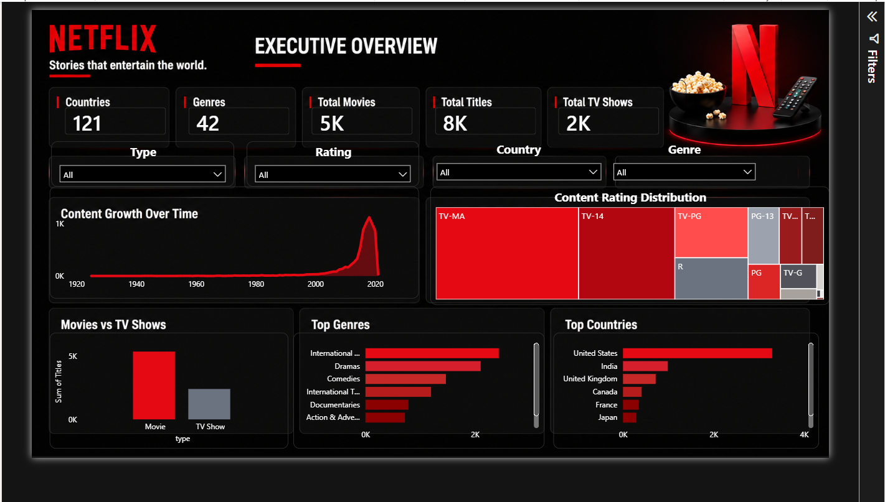
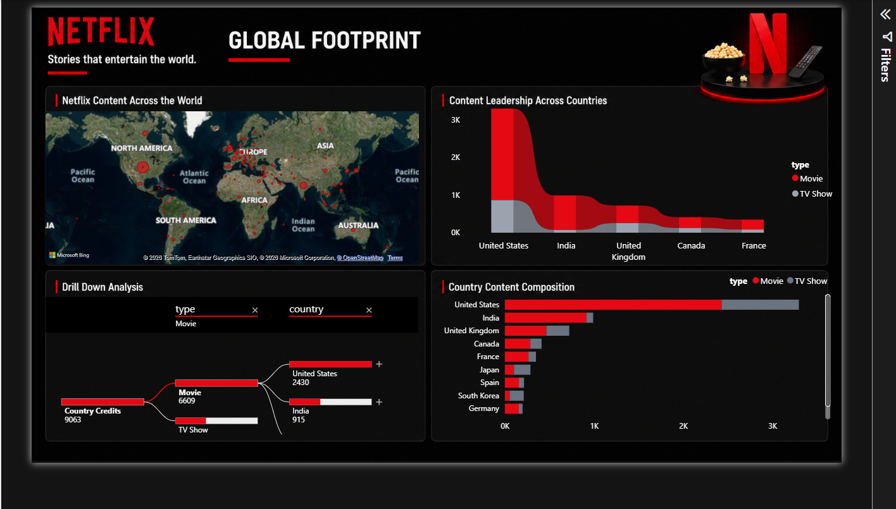
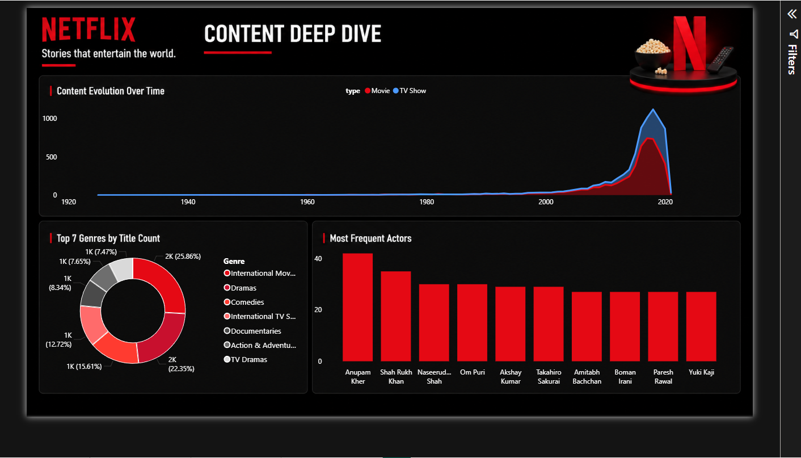

<h1 align="center">
🎬 CineMetrix
</h1>

<h3 align="center">
Netflix Content Analytics Dashboard
</h3>

<p align="center">
Stories Hidden Behind 7,787 Titles
</p>

<p align="center">

<a href="https://bhaskar21-7.github.io/CineMetrix/">

</a>

<a href="https://github.com/bhaskar21-7/CineMetrix">

</a>

</p>
---
# 📊 Dashboard Preview

## Executive Overview

Provides a high-level summary of Netflix's content catalog.

- KPI Cards
- Content Growth Trend
- Rating Distribution
- Movies vs TV Shows
- Top Genres
- Top Countries



---

## Global Footprint

Analyzes Netflix's geographical content distribution.

- Country-wise Contribution
- Geographic Analysis
- Content Type Composition
- Drill-down Analysis



---

## Content Deep Dive

Detailed exploration of genres and cast members.

- Content Evolution
- Genre Analysis
- Top Cast Members



---

CineMetrix explores Netflix's content catalog to uncover trends in content growth, geographical distribution, ratings, genres, and cast popularity. The project combines data cleaning, exploratory analysis, and interactive dashboard design to transform raw data into business insights.

---

## 📌 Project Highlights

- Analyzed **7,787 Netflix titles**
- Built an interactive **3-page Power BI dashboard**
- Performed data cleaning and feature engineering using Python
- Explored content trends across countries, genres, ratings, and release years
- Generated dashboard-ready datasets for visualization

---

## 🛠 Tools & Technologies

- Python
- Pandas
- NumPy
- Matplotlib
- Seaborn
- SciPy
- Power BI
- Jupyter Notebook

---

## 📂 Dataset

**Netflix Movies and TV Shows Dataset**

Source: https://www.kaggle.com/datasets/shivamb/netflix-shows

- Rows: 7,787
- Columns: 12

---
# 🔍 Key Insights

- Movies dominate Netflix's catalog throughout its history.
- Content growth accelerated significantly after 2015.
- A small group of countries contributes the majority of titles.
- TV-MA and TV-14 are the most common maturity ratings.
- Drama and International Movies are among the most frequent genres.
- Country and content type show a statistically significant but weak association.

---

# 📁 Project Structure

```text
CineMetrix/
│
├── data/
│   ├── raw/
│   ├── processed/
│   └── dashboard/
│
├── notebooks/
│   ├── 01_Data_Understanding.ipynb
│   ├── 02_Data_Cleaning.ipynb
│   ├── 03_Exploratory_Data_Analysis.ipynb
│   ├── 04_Dashboard_Preparation.ipynb
│   └── 05_Dashboard_Planning.ipynb
│
├── dashboard/
├── images/
├── requirements.txt
├── README.md
└── .gitignore
```

---

# 🚀 Getting Started

Clone the repository:

```bash
git clone https://github.com/bhaskar21-7/CineMetrix.git
```

Install dependencies:

```bash
pip install -r requirements.txt
```

Launch the notebooks sequentially to reproduce the analysis.

---

## 👤 Author

**Bhaskar Jha**

B.Sc. Statistics | Will Be Best Data Scientist

GitHub: https://github.com/bhaskar21-7
